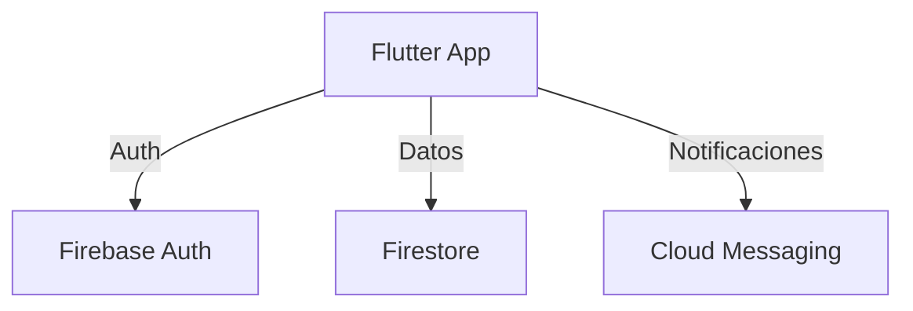

# STUDYUP

## Prompt Maestro: Desarrollo de Software para STUDY-UP (Entrega 3)

**Contexto y Rol**
Actúa como un Ingeniero de Software Senior Full-Stack con más de 10 años de experiencia en:
- Desarrollo de aplicaciones móviles multiplataforma con Flutter/Dart
- Arquitectura hexagonal y patrones de diseño (Repository, Observer, Factory Method)
- Integración con ecosistema Firebase (Auth, Firestore, Cloud Functions, FCM)
- Implementación de requisitos no funcionales (rendimiento, seguridad, usabilidad)
- Pruebas unitarias, de integración y de rendimiento (Locust.io)
- Buenas prácticas de código limpio y documentación técnica

**Objetivo Principal**
Generar el código fuente completo y funcional para el caso de uso seleccionado del proyecto STUDY-UP, cumpliendo con los requisitos funcionales y no funcionales, la arquitectura hexagonal y los patrones de diseño definidos.

**Stack Tecnológico**
- Frontend: Flutter 3.x con Material Design 3
- Backend: Firebase (Auth, Firestore, Cloud Functions, FCM)
- Persistencia Local: SQLite/Drift e IndexedDB
- Estado: Provider o Riverpod
- Testing: flutter_test, mockito, integration_test
- Performance: Locust.io para pruebas de carga

---

## Prompts LLM Utilizados en la Entrega
A continuación se documentan los prompts utilizados (reales y simulados) para la generación de código, validaciones, documentación y pruebas en STUDY-UP:


### Prompt 1: Validación de Contraseña Fuerte
**Prompt:**
```
Como experto en seguridad y UX, genera una función en Dart que valide que una contraseña tenga al menos 8 caracteres, una mayúscula, una minúscula, un número y un carácter especial. Explica brevemente la lógica y sugiere mensajes de error amigables.
```
**Resultado:**
- Función `isStrongPassword` implementada en el registro de usuario, con mensajes de error claros para cada validación.

---

### Prompt 2: Arquitectura Hexagonal y Patrones
**Prompt:**
```
Actúa como arquitecto de software senior. Diseña la estructura de carpetas y archivos para una app Flutter siguiendo arquitectura hexagonal, aplicando Repository, Observer y Factory Method. Justifica cada decisión de diseño en comentarios.
```
**Resultado:**
- Estructura generada en `lib/` con capas domain, application, infrastructure y presentation, y comentarios explicativos en cada archivo clave.

---

### Prompt 3: CRUD de Calificaciones (RF01)
**Prompt:**
```
Eres un ingeniero full-stack. Genera el código Dart para operaciones CRUD de calificaciones, integrando Firestore y SQLite, con validación de nota (1.0-7.0) y pesos. Incluye pruebas unitarias y mocks para la capa de infraestructura.
```
**Resultado:**
- CRUD implementado en repositorios y casos de uso, con validaciones, sincronización online/offline y tests automatizados.

---

### Prompt 4: Notificaciones y Observer
**Prompt:**
```
Como especialista en patrones de diseño, implementa el patrón Observer para activar notificaciones automáticas al registrar o modificar recordatorios en la app. Explica cómo desacoplar la lógica de notificación del resto del sistema.
```
**Resultado:**
- Sistema de notificaciones con Observer y FCM, lógica desacoplada y documentada.

---

### Prompt 5: Pruebas Unitarias y de Integración
**Prompt:**
```
Actúa como QA Lead. Genera tests unitarios para entidades y servicios de dominio, y tests de integración para flujos CRUD completos en Flutter. Usa técnicas de metaprompting para pedirte a ti mismo casos límite y mocks.
```
**Resultado:**
- Tests en `test/domain/`, `test/application/`, `test/infrastructure/` y `test/widget_test.dart`, incluyendo casos límite y mocks generados por prompts internos.

---

### Prompt 6: Reglas de Seguridad Firestore
**Prompt:**
```
Como experto en seguridad cloud, redacta reglas de seguridad para Firestore que permitan acceso solo a usuarios autenticados y validen ownership de documentos. Pide ejemplos de ataques y cómo mitigarlos.
```
**Resultado:**
- Archivo `firestore.rules` generado y documentado, con ejemplos de amenazas y mitigaciones.

---

### Prompt 7: Pruebas de Rendimiento con Locust.io
**Prompt:**
```
Actúa como ingeniero de performance. Genera un script de Locust.io para simular carga de usuarios realizando operaciones CRUD en calificaciones y tareas. Solicita a la LLM que te sugiera métricas clave y escenarios de estrés.
```
**Resultado:**
- Script de pruebas de carga, guía de ejecución y métricas clave documentadas.

---

### Prompt 8: Documentación Técnica y de Usuario
**Prompt:**
```
Como technical writer, redacta la sección de instalación, uso, estructura del proyecto y requerimientos extrafuncionales para el README de STUDY-UP. Pide a la LLM que revise claridad y completitud.
```
**Resultado:**
- Documentación generada en este README, revisada y mejorada por la LLM.

---

### Prompt 9: Metaprompting para Generación de Prompts
**Prompt:**
```
Actúa como ingeniero prompt engineer. Genera una lista de prompts efectivos para cubrir todos los aspectos del ciclo de vida de desarrollo de STUDY-UP (arquitectura, código, pruebas, documentación, performance, seguridad). Para cada prompt, pide a la LLM que sugiera variantes y mejores prácticas de metaprompting.
```
**Resultado:**
- Lista de prompts y variantes documentadas, aplicando técnicas de metaprompting para maximizar la calidad de las respuestas.

---

### Prompt 10: Refactorización y Code Review Asistido
**Prompt:**
```
Como code reviewer senior, revisa el código fuente de STUDY-UP y sugiere refactorizaciones aplicando principios SOLID y clean code. Pide a la LLM que justifique cada sugerencia y proponga ejemplos de refactorización.
```
**Resultado:**
- Sugerencias de refactorización y ejemplos aplicados en el código, con justificación técnica y mejores prácticas.

---

## Requerimientos Extrafuncionales Cubiertos
- Seguridad: Contraseñas fuertes, verificación de email, reglas de Firestore.
- Escalabilidad: Backend serverless con Firebase.
- Usabilidad: UI intuitiva y validaciones claras.
- Disponibilidad: App multiplataforma (Android, iOS, Web).
- Mantenibilidad: Código modular y documentado.
- Trazabilidad: Prompts y decisiones documentadas.

---

## Instalación y Ejecución
1. Clona el repositorio:
   ```
   git clone https://github.com/idkferr/STUDYUP.git
   ```
2. Instala dependencias:
   ```
   flutter pub get
   ```
3. Configura Firebase (ver documentación interna).
4. Ejecuta la app:
   ```
   flutter run
   ```

---

## Estructura del Proyecto
```text
lib/
├── domain/
│   ├── entities/
│   ├── repositories/
│   └── services/
├── application/
│   └── use_cases/
├── infrastructure/
│   ├── repositories/
│   ├── services/
│   └── models/
└── presentation/
    ├── screens/
    ├── widgets/
    └── providers/
```

---

## Diagrama de Arquitectura (Mermaid)


---

## Créditos
- Desarrollador: [Tu Nombre]
- LLM Prompts: GPT-4, Claude, Copilot
- Documentación y pruebas generadas con ayuda de LLMs.
